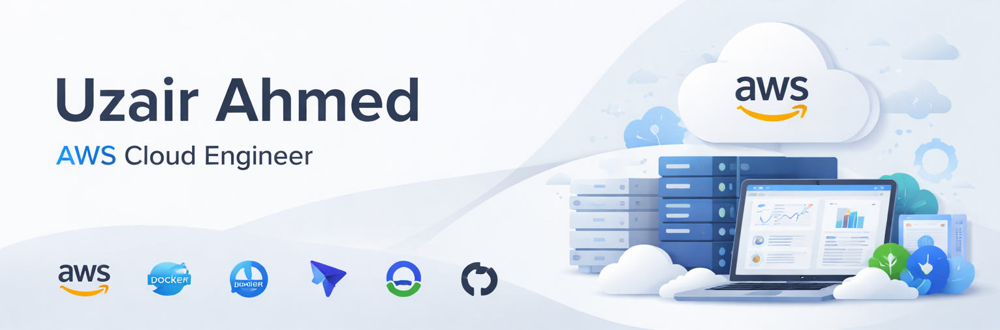

# Uzair Ahmed

AWS Cloud & DevOps Engineer | AWS Certified | Docker | Kubernetes | Terraform | Linux

---

# Experience

**Cloud & DevOps Engineer — INIT Global**  
2+ years designing and operating production-grade AWS infrastructure for customer workloads.

Experience includes:

- AWS Architecture & Multi-AZ Infrastructure
- Kubernetes (EKS) Production Deployments
- Terraform Infrastructure as Code
- CI/CD Pipelines (CodePipeline, CodeBuild, GitHub)
- Docker Containerization & Deployments
- Cost Optimization & Cloud Troubleshooting

---

## Certifications

 &nbsp;&nbsp;

---

## Tech Stack

 &nbsp;&nbsp;&nbsp;
 &nbsp;&nbsp;&nbsp;
 &nbsp;&nbsp;&nbsp;
 &nbsp;&nbsp;&nbsp;
 &nbsp;&nbsp;&nbsp;

---

## Engineering Focus

- Cloud Architecture
- Infrastructure as Code
- Production Troubleshooting
- Containerization
- DevOps Automation
- Scalable Cloud Systems

---
